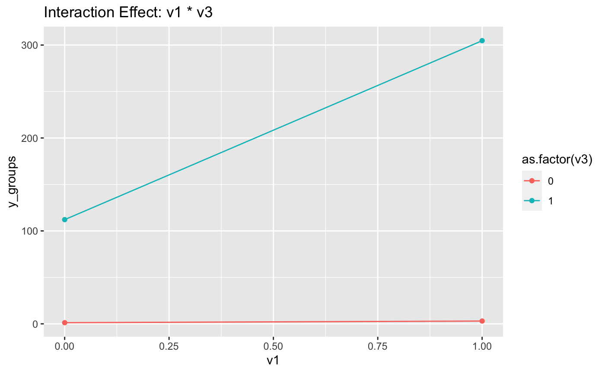

# InteractionPlot

Nicole Wang


## Installation

To install InteractionPlot package, copy and paste the following code into your console:

```r
library(devtools)
devtools::install_github("nwangcw/test", build = TRUE, build_opts = c("--no-resave-data", "--no-manual"),force = TRUE)
```

## Usage

To install InteractionPlot package, copy and paste the following code into your console:

```r
library(InteractionPlot)
```

## Example

### Example 1 -- Simulation example

```{r}
set.seed(1234)

n <- 100 
v1 = rbinom(n, 1, 0.4)
v2 <- rbinom(n, 1, 0.5)  
v3 <- rbinom(n, 1, 0.6)  
v4 = rnorm(n)
v5 = rbinom(n, 1, 0.6)
interaction_effect1 <- v2 * v3 
interaction_effect2 <- v1 * v3 

y <- 2 * v1 + 2 * v2 + 2 * v3 + 200 * interaction_effect1 + 200 * interaction_effect2 + rnorm(n,mean=0,sd=1)  


data <- data.frame(y = y, v1 = v1, v2 = v2, v3 = v3, v4 = v4, v5 = v5)


prepared_data <- prepare_data(data, "y")
print(head(prepared_data))

interaction_matrix <- create_interaction_matrix(prepared_data, "y")
print(head(interaction_matrix))

full_results <- analyze_interactions(data, interaction_matrix, "y")
print(full_results)
significant_interactions <- extract_significant_p_values(full_results)
print(significant_interactions)

fit_final_regression <- final_regression(prepared_data, "y")
fit_final_regression

plots <- plot_interaction_effects(prepared_data, significant_interactions)
plots
```

### Example 2 -- Real world data

```{r}

library(InteractionPlot)
library(MASS)

data<- as.data.frame(birthwt)
response_variable <-"lwt"

prepared_data <- prepare_data(data, response_variable)
print(head(prepared_data))

interaction_matrix <- create_interaction_matrix(prepared_data, response_variable)
print(head(interaction_matrix))

full_results <- analyze_interactions(prepared_data, interaction_matrix, response_variable)
print(full_results)

significant_interactions <- extract_significant(full_results)
print(significant_interactions)

fit_final_regression <- final_regression(prepared_data, response_variable)
fit_final_regression

plots <- plot_interaction_effects(prepared_data, response_variable, significant_interactions)
plots

```
### plots



