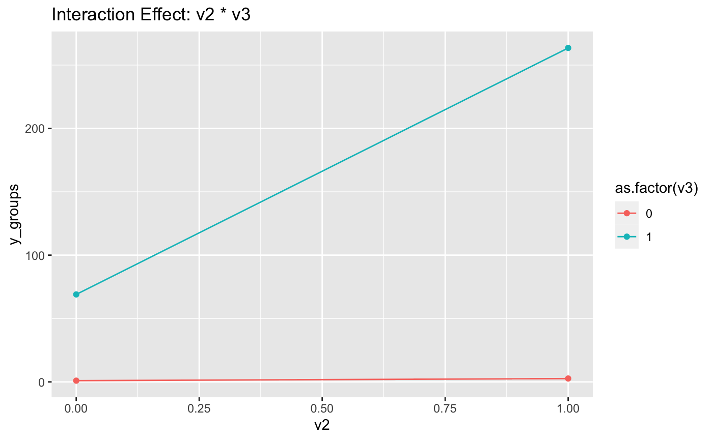

# InteractionPlot

Nicole Wang


Interaction effects stand apart from other variables that you can measure directly. They need to be inferred indirectly through an interaction term in statistics model. Our package plans to streamline this process. We start by having the model $Y_{i,j}=X_1...+X_n+X_i*X_j$, for i,j=1..n. We'll need users to specify the response variable first. Based on this, we'll filter out all non-binary variables and create a matrix to hold all combinations of interaction variables, helping to cut down on computing costs. We'll then apply linear regression analysis to the data and highlight the significant interaction terms. Lastly, we'll take these insights and generate visualizations automatically with description of i number in main label, making it easier for users to understand the interaction effects in their data.

## Installation

To install InteractionPlot package, copy and paste the following code into your console:

```r
library(devtools)
devtools::install_github("nwangcw/test", build = TRUE, build_opts = c("--no-resave-data", "--no-manual"))
```

## Usage

To install InteractionPlot package, copy and paste the following code into your console:

```r
library(InteractionPlot)
```

## Example

### Example 1 -- Simulation example

##### set v1, v2, v3, v5 as binary, v4 and y as continous.

##### set 2 interaction effect, v2 * v3 and v1 * v3.

```{r}
set.seed(1234)
library(ggplot2)
library(dplyr)
n <- 100 
v1 = rbinom(n, 1, 0.4)
v2 <- rbinom(n, 1, 0.5)  
v3 <- rbinom(n, 1, 0.6)  
v4 = rnorm(n)
v5 = rbinom(n, 1, 0.6)
interaction_effect1 <- v2 * v3 
interaction_effect2 <- v1 * v3 

y <- 2 * v1 + 2 * v2 + 2 * v3 + 200 * interaction_effect1 + 200 * interaction_effect2 + rnorm(n,mean=0,sd=1)  

data <- data.frame(y = y, v1 = v1, v2 = v2, v3 = v3, v4 = v4, v5 = v5)

```

#### Step 1 : Data Cleaning and Preparation

##### keep y, and filter out continous variables (v4 in this case) 

##### construct a matrix for names of interaction item for reducing computing works

```{r}
prepared_data <- prepare_data(data, "y")
print(head(prepared_data))

interaction_matrix <- create_interaction_matrix(prepared_data, "y")
print(head(interaction_matrix))
```

#### Step 2 : Fit Regression Model and Extract Significant Interactions

##### The model will fit for each interaction term, for example:(in this case v4 was removed because it's continuous)

##### y = v1 + v2 + v3 + v5 + v1 * v2

##### y = v1 + v2 + v3 + v5 + v1 * v3

##### y = v1 + v2 + v3 + v5 + v2 * v3,....etc

##### We may see some terms are missing in full_results because of their p-value is NA 

```{r}
full_results <- analyze_interactions(data, interaction_matrix, "y")
print(full_results)
significant_interactions <- extract_significant(full_results)
print(significant_interactions)
```


##### we can see v1 * v3 and v2 * v3 are significant (p < 0.05), just as what we are setting in simulation.

#### Step 3 : Generate Final Regression

##### final model: y = v1 + v2 + v3 + v1 * v3 + v2 * v3

```{r}
fit_final_regression <- final_regression(prepared_data, "y")
fit_final_regression
```


#### Step 4 : Plot Interaction Effects

```{r}
plots <- plot_interaction_effects(prepared_data, "y", significant_interactions)
plots
```
##### 2 plots of interaction v1*v3 (each variable has opportunity to be putted on the  x-axis)


##### 2 plots of interaction v2*v3 (each variable has opportunity to be putted on the  x-axis)



### Example 2 -- Real world data

#### Step 1 : Data Cleaning and Preparation

```{r}

library(InteractionPlot)
library(MASS)
library(ggplot2)
library(dplyr)

data<- as.data.frame(birthwt)
response_variable <-"lwt"

prepared_data <- prepare_data(data, response_variable)
print(head(prepared_data))

interaction_matrix <- create_interaction_matrix(prepared_data, response_variable)
print(head(interaction_matrix))
```
#### Step 2 : Fit Regression Model and Extract Significant Interactions

##### The model will fit for each interaction term

##### We may see some terms are missing in full_results because of their p-value is NA 

```{r}
full_results <- analyze_interactions(prepared_data, interaction_matrix, response_variable)
print(full_results)
significant_interactions <- extract_significant(full_results)
print(significant_interactions)
```


##### we can see somke * ht and somke * ui are significant (p < 0.05), just as what we are setting in simulation.

#### Step 3 : Generate Final Regression

##### final model: y = smoke + ui + ht + somke * ht + somke * ui

```{r}
fit_final_regression <- final_regression(prepared_data, response_variable)
fit_final_regression
```


#### Step 4 : Plot Interaction Effects

```{r}
plots <- plot_interaction_effects(prepared_data, response_variable, significant_interactions)
plots
```
##### 2 plots of interaction somke * ht (each variable has opportunity to be putted on the  x-axis)


##### 2 plots of interaction somke * ui (each variable has opportunity to be putted on the  x-axis)


## Analysis 

Further analysis and details are available in package documentations and [Vignette](https://github.com/nwangcw/test/blob/main/vignettes/my-vignette.Rmd).
